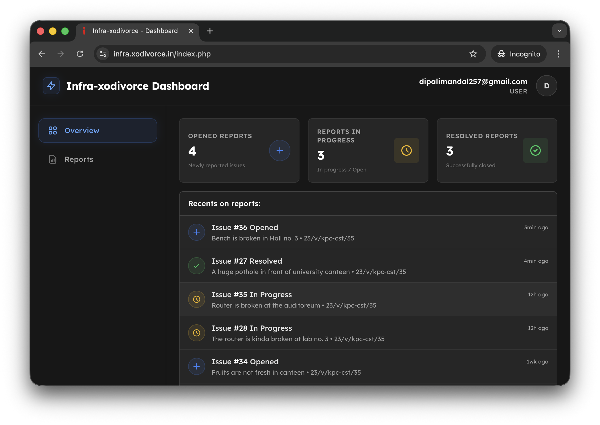

## Infra-xodivorce-in: powered by @xodivorce

### 👀 Preview


#### A real-time map-based reporting system for campus infrastructure issues, built to improve visibility, accountability, and resolution efficiency.

[](https://github.com/xodivorce/infra-xodivorce-in/)
[](https://github.com/xodivorce/infra-xodivorce-in/)
[](https://github.com/xodivorce/infra-xodivorce-in/)

> **🥰 Like this project? Please consider giving it a Star (🌟) on GitHub to show us your appreciation. Thank you!**

### 🧩 Offical Repositories

[](https://github.com/xodivorce/infra-xodivorce-in)
[](https://gitea.neosubhamoy.com/xodivorce/infra-xodivorce-in)

### ⚡️ Technologies Used


### 🛠️ Installation
   Want to get started quickly? Follow the instructions below to install and run the project on your system.

1. **Clone the repository**
   - Clone the repository to your local machine:
     ```bash
     # Clone using SSH
     git clone git@github.com:xodivorce/infra-xodivorce-in.git
     # Or using HTTPS
     git clone https://github.com/xodivorce/infra-xodivorce-in.git
     ```

2. **Set up your environment**
   - Ensure you have [Node.js](https://nodejs.org/) version 14 or higher installed.
   - Install [PHP](https://www.google.com/search?client=safari&rls=en&q=php&ie=UTF-8&oe=UTF-8), [MySQL](https://www.mysql.com), [Apache](https://www.apache.org), or [XAMPP](https://www.apachefriends.org).

3. **Install dependencies**
   - Navigate to the project directory `src` and install the required packages:
     ```bash
     # Go to the directory
     cd src
     # Install dependencies
     npm install
     ```

4. **Configure Environment & Database**
   - Set up your `.env` file based on `.env.example` file.
   - Set up your MySQL database schema.

5. **Run the tool**
   - Run the application from your terminal:
     ```bash
     # Run Tailwind CSS using this command
     npm run tcss
     ```

🐞 **Got Ideas or Spotted a Bug?**  
   Don’t be shy! [*Open an issue*](https://github.com/xodivorce/infra-xodivorce-in/issues) to discuss new features, enhancements, or any bugs you find. Your feedback is golden!!

> <strong>⚠️ Frequently Asked Questions:</strong>
> <ul>
>   <li><a href="FAQs/FAQ_EN.md" style="color:black;text-decoration:none;">🇺🇸 FAQ in English</a></li>
>   <li><a href="FAQs/FAQ_IN.md" style="color:black;text-decoration:none;">🇮🇳 FAQ हिंदी में</a></li>
>   <li><a href="FAQs/FAQ_RU.md" style="color:black;text-decoration:none;">🇷🇺 ЧаВо на Русском</a></li>
>   <li><a href="FAQs/FAQ_IT.md" style="color:black;text-decoration:none;">🇮🇹 FAQ in Italiano</a></li>
> </ul>

### 📄 License
   This project is licensed under a [**MIT License**](LICENSE.txt). You are free to use, modify, and distribute this software with proper attribution. 

> 🧠 Follow me on [Instagram](https://www.instagram.com/xodivorce) or check out more projects at [xodivorce.in](https://www.xodivorce.in)

<br></br>

****

A open-source project - crafted with ❤️ by **xodivorce**. Made on Earth, by **Humans**.